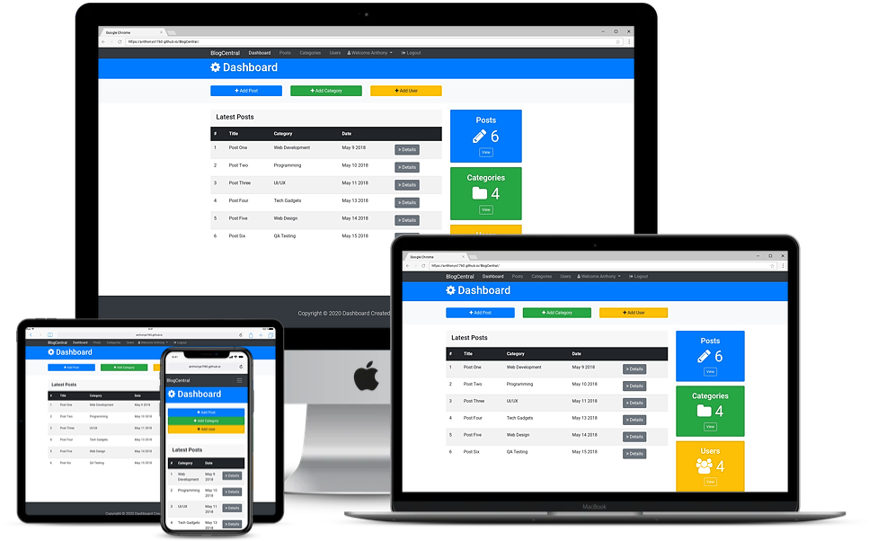

# BlogCentral Dashboard

Dashboard for bloggers who want to write, edit and post blogs online. 

## Project Specifications

- Add New Posts
- Add New Categories
- Add New Users
- Edit Posts
- Edit settings that allow or deny User Registration and change homepage format.
- View and choose different categories based on a variety of different topics.
- Search for specific categories of interest.
 
## Steps to execute this App:
- Download the entire code 
- Open up the index.html.
- [View Live Site](https://anthonys1760.github.io/BlogCentral/index.html)

## Technologies used: 
- HTML
- CSS
- Javascript

